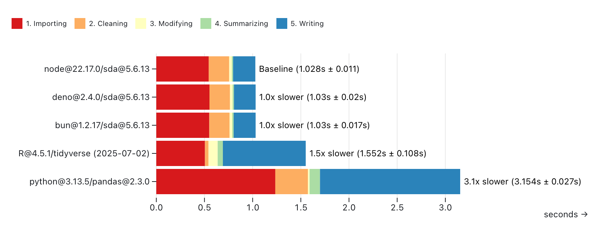
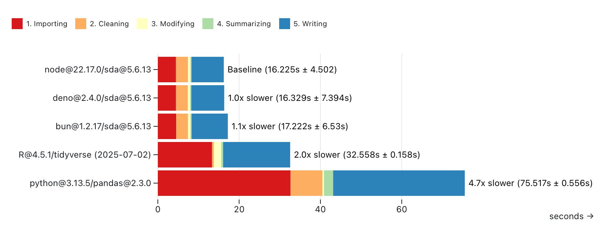

# Simple-data-analysis benchmarks

To test the performance of **simple-data-analysis@2.0.1**, we calculated the average temperature per decade and city with the daily temperatures from the [Adjusted and Homogenized Canadian Climate Data](https://api.weather.gc.ca/collections/ahccd-annual).

We ran the same calculations with **simple-data-analysis@1.8.1** (both NodeJS and Bun), **Pandas (Python)**, and the **tidyverse (R)**.

In each script, we:

1. Load a CSV file (_Importing_)
2. Select four columns, remove rows with missing temperature, convert date strings to date and temperature strings to float (_Cleaning_)
3. Add a new column _decade_ and calculate the decade (_Modifying_)
4. Calculate the average temperature per decade and city (_Summarizing_)
5. Write the cleaned-up data that we computed the averages from in a new CSV file (_Writing_)

Each script has been run ten times on a MacBook Pro (Apple M1 Pro / 16 GB), and the durations have been averaged.

The charts displayed below come from this [Observable notebook](https://observablehq.com/@nshiab/simple-data-analysis-benchmarks).

## Small file

With _ahccd-samples.csv_:

- 74.7 MB
- 19 cities
- 20 columns
- 971,804 rows
- 19,436,080 data points

As we can see, **simple-data-analysis@1.8.1** was the slowest, but **simple-data-analysis@2.0.1** is now the fastest.

## Big file

With _ahccd.csv_:

- 1.77 G
- 773 cities
- 20 columns
- 22,051,025 rows
- 441,020,500 data points

The file was too big for **simple-data-analysis@1.8.1**, so it's not included here.

Again, **simple-data-analysis@2.0.1** is now the fastest option.

